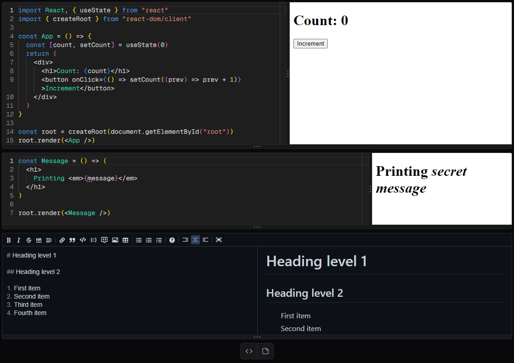

# 📕 Notebook

> Interactive browser development environment for JavaScript

All in one code editor, execution environment, and note-taking app for JavaScript. Quickly try out npm packages, or take and save notes on new JavaScript concepts without the hassle of setting up a development environment. Try it out [here](https://mwpryer-notebook.vercel.app/)!

    

## Features

- Compile and run your JavaScript code directly in the browser
- Extremely fast bundling with esbuild
- Easily download and import npm packages by name
- Utilizes the same editor that powers VS Code
- Code formatting using Prettier
- Write notes with a rich text editor
- Re-arrange code cells and their execution context instantly
- First-class support for React and JSX
- Download or upload your notebooks as JSON files
- Light and dark mode

## Technologies

Built using TypeScript, Next.js, React, and Tailwind CSS.

Bundling is done in the browser using the WASM version of [esbuild](https://esbuild.github.io/). Packages are fetched with a custom esbuild plugin and then cached in IndexedDB for performance using [localForage](https://localforage.github.io/localForage/). Local state is managed using [Redux Toolkit](https://redux-toolkit.js.org/) with a custom hook to easily get the execution context of the code cells.

UI Components were scaffolded using [shadcn/ui](https://ui.shadcn.com/). The code editor is [@monaco-editor/react](https://github.com/suren-atoyan/monaco-react), a React wrapper for [monaco-editor](https://microsoft.github.io/monaco-editor/). The markdown editor is [@uiw/react-md-editor](https://uiwjs.github.io/react-md-editor/).

## Todo

- [ ] JSX highlighting
- [ ] Add support for TypeScript
- [ ] Ability to store notebooks in the cloud
- [ ] Public and private notebooks
- [ ] Real-time collaborative editing
